# ERCOT Power Market Intelligence Platform

> **Stack:** Python · DuckDB · Plotly · pandas · statsmodels · Jupyter

Quantitative analysis of ERCOT's energy transition from 2015 to 2024, covering generation mix, renewable growth, Winter Storm Uri vulnerability, duck-curve pressure, 2030 renewable forecasting, and revenue adequacy signals.

## Research Questions

1. How has ERCOT's generation mix transformed from 2015 to 2024?
2. Is there measurable price cannibalization as renewable penetration increases?
3. What does Winter Storm Uri reveal about grid vulnerability?
4. What does the renewable trajectory imply for ERCOT by 2030?
5. Are ERCOT's energy-only market signals showing early revenue adequacy stress?

## Key Findings

- **Renewable transformation:** ERCOT renewable share increased from 10.3% in 2015 to 30.2% in 2024, a 19.9 percentage point gain. Solar generation increased 748% from 2019 to 2024.
- **Coal decline and gas balancing role:** Coal fell from 26.6% to 11.3% of average monthly generation share. Natural gas remained the largest source at 50.7% in 2024.
- **Price cannibalization caveat:** The available dataset supports only a gas-implied price proxy, not actual ERCOT hub/LMP price analysis. The full proxy regression produced a renewable coefficient of -0.000 $/MWh per ppt (p=0.885); this should be interpreted as a limitation, not evidence of no cannibalization.
- **Winter Storm Uri:** ERCOT load peaked at 69.7 GW during the February 2021 event. Public post-storm figures indicate gas plant failures caused approximately 88% of documented forced outages, compared with roughly 6% from wind.
- **Duck curve:** Estimated summer duck-curve depth moved from 24.7 GW in 2019 to 25.3 GW in 2024, increasing the importance of flexible resources.
- **2030 outlook:** Holt-Winters forecasting projects ERCOT renewable share at 45.1% by December 2030.
- **Revenue adequacy:** Scarcity proxy hours changed from 176 in 2015 to 279 in 2024. The Revenue Adequacy Index was 0.349 in 2024 and negative in 2015 and 2016, then positive from 2017 onward.

## Visualizations

Each PNG preview below has a companion interactive Plotly HTML file in `outputs/charts/`.

### ERCOT Generation Mix Stacked Area

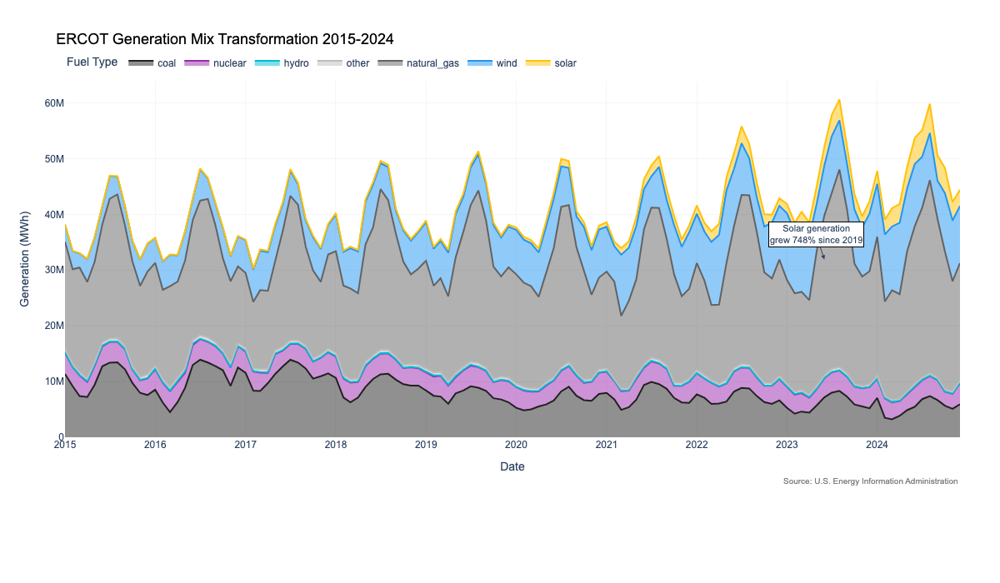

Interactive HTML: [`chart_1a_generation_mix_stacked.html`](outputs/charts/chart_1a_generation_mix_stacked.html)

### Renewable Share Trend

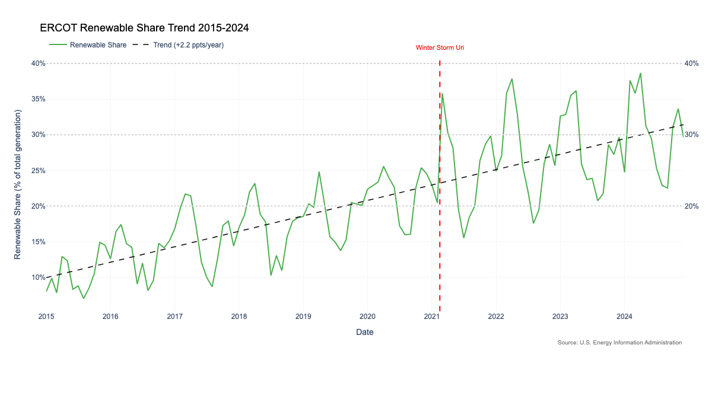

Interactive HTML: [`chart_1b_renewable_share_trend.html`](outputs/charts/chart_1b_renewable_share_trend.html)

### Price Cannibalization Scatter

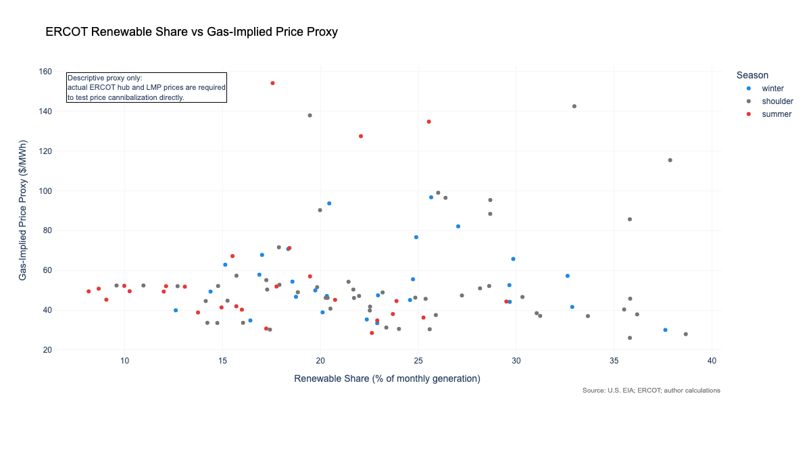

Interactive HTML: [`chart_2a_price_cannibalization_scatter.html`](outputs/charts/chart_2a_price_cannibalization_scatter.html)

### Gas and Electricity Price Correlation

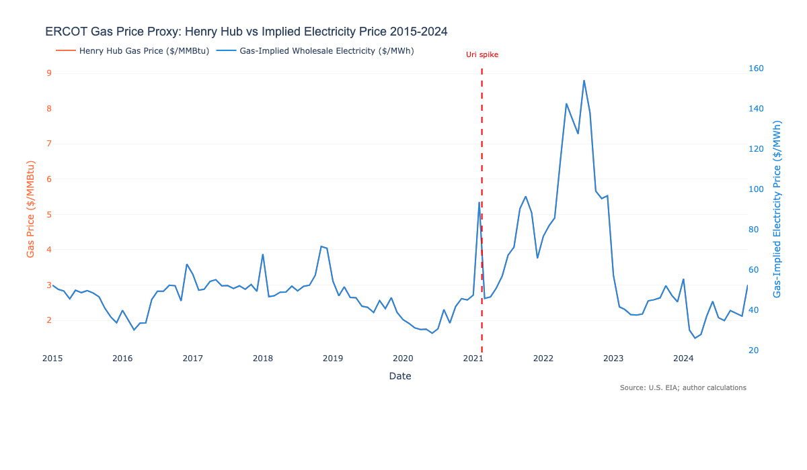

Interactive HTML: [`chart_2b_gas_electricity_correlation.html`](outputs/charts/chart_2b_gas_electricity_correlation.html)

### Winter Storm Uri Demand Timeline

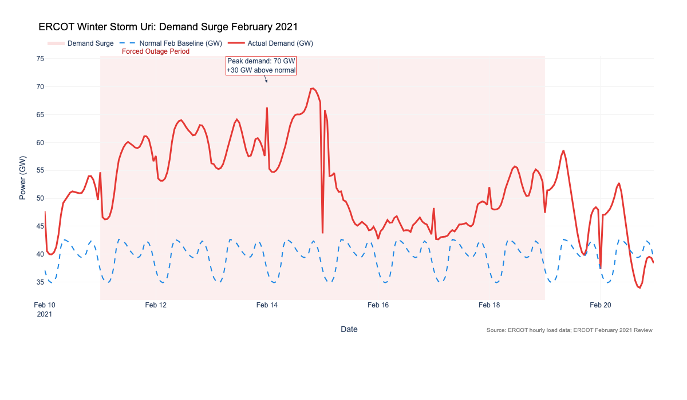

Interactive HTML: [`chart_3a_storm_uri_timeline.html`](outputs/charts/chart_3a_storm_uri_timeline.html)

### Winter Storm Uri Fuel Failure Breakdown

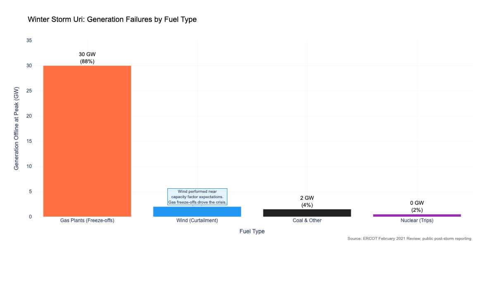

Interactive HTML: [`chart_3b_uri_fuel_failures.html`](outputs/charts/chart_3b_uri_fuel_failures.html)

### Duck Curve Evolution

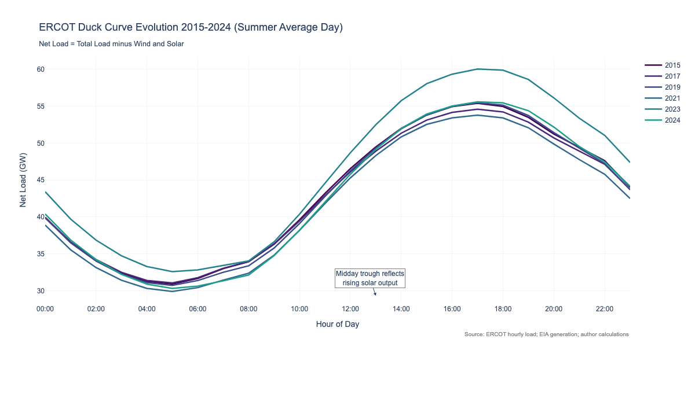

Interactive HTML: [`chart_4a_duck_curve_evolution.html`](outputs/charts/chart_4a_duck_curve_evolution.html)

### Duck Curve Depth

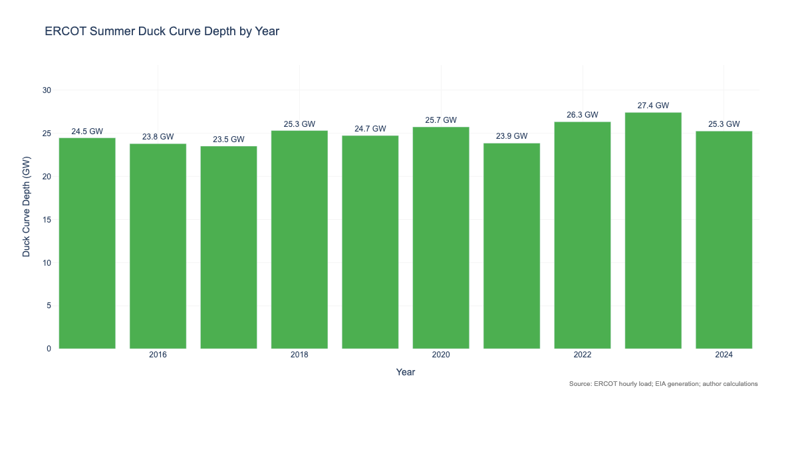

Interactive HTML: [`chart_4b_duck_curve_depth.html`](outputs/charts/chart_4b_duck_curve_depth.html)

### Renewable Forecast to 2030

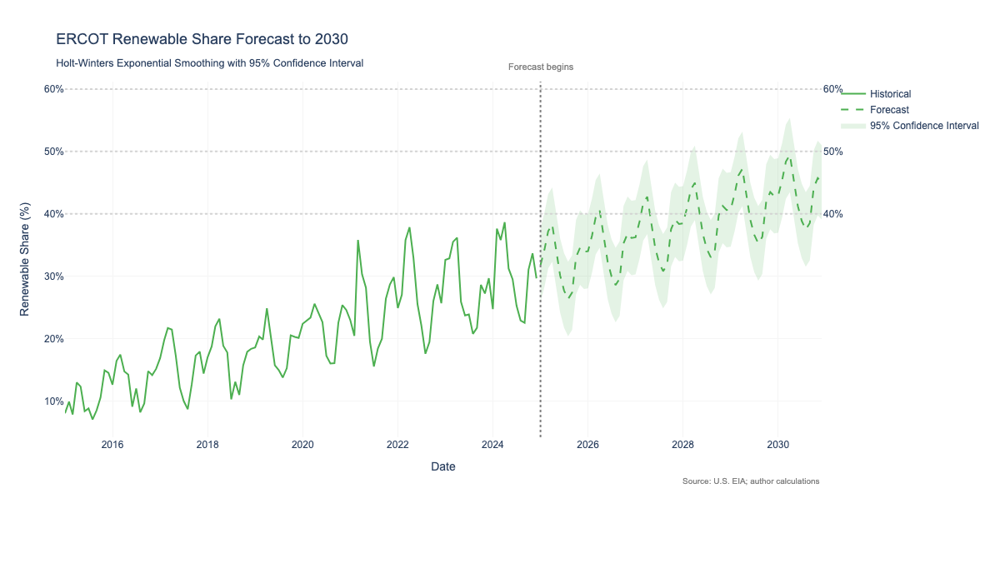

Interactive HTML: [`chart_5a_renewable_forecast_2030.html`](outputs/charts/chart_5a_renewable_forecast_2030.html)

### Scarcity Hours

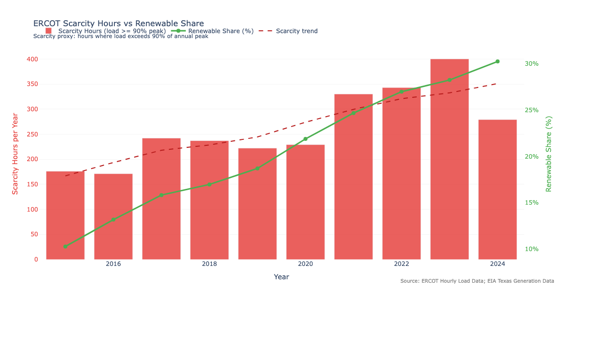

Interactive HTML: [`chart_7a_scarcity_hours_declining.html`](outputs/charts/chart_7a_scarcity_hours_declining.html)

### Curtailment Pressure

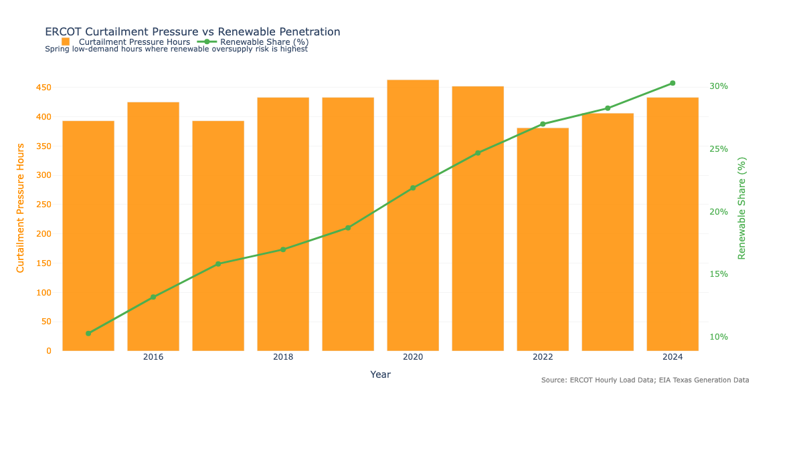

Interactive HTML: [`chart_7b_curtailment_pressure_growing.html`](outputs/charts/chart_7b_curtailment_pressure_growing.html)

### Revenue Adequacy Index

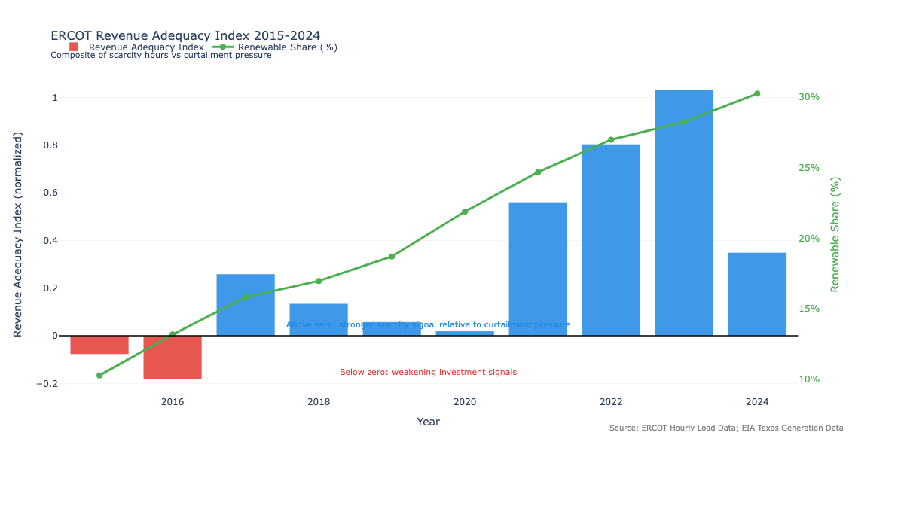

Interactive HTML: [`chart_7c_revenue_adequacy_index.html`](outputs/charts/chart_7c_revenue_adequacy_index.html)

### Market Adequacy Synthesis

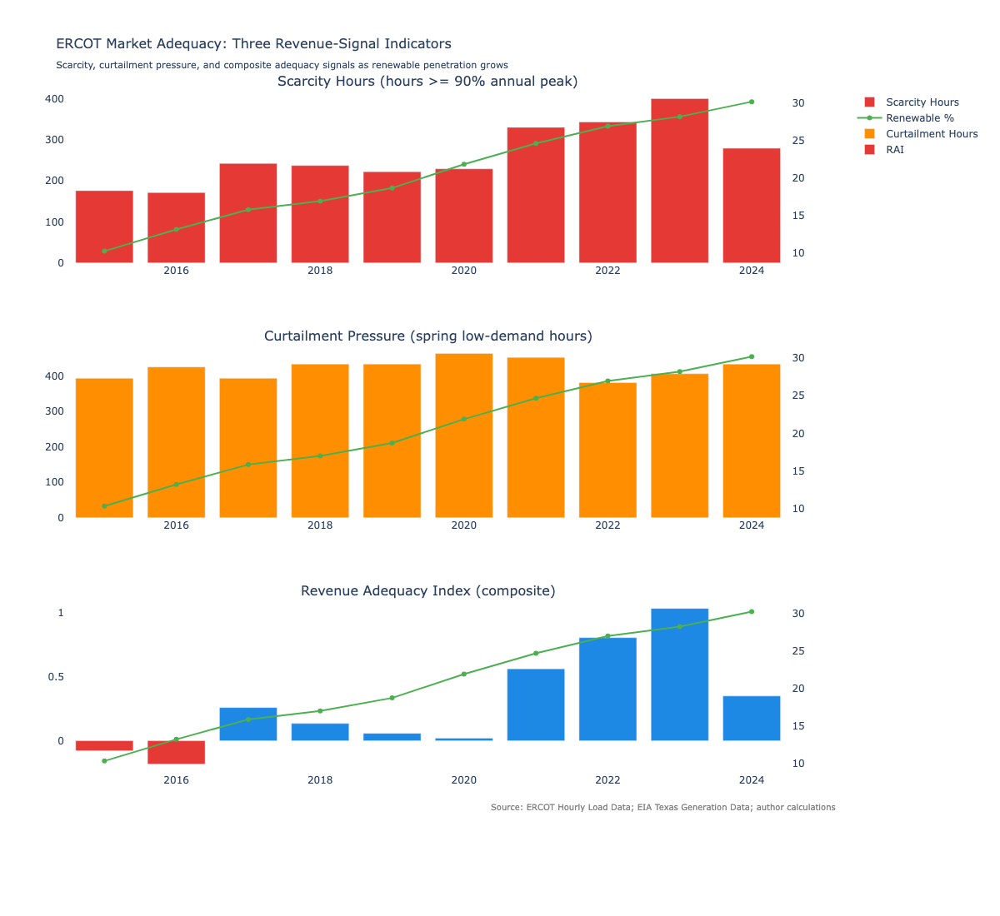

Interactive HTML: [`chart_7d_market_adequacy_synthesis.html`](outputs/charts/chart_7d_market_adequacy_synthesis.html)

## Project Structure

```text
notebooks/                 # Jupyter notebooks for ingestion, SQL, analysis, and deliverables
scripts/                   # Python ingestion and validation pipeline
sql/                       # DuckDB SQL query layer
data/processed/            # Clean analysis-ready CSVs
outputs/charts/            # Plotly HTML and PNG charts
outputs/tableau_exports/   # Tableau-ready CSV exports
outputs/analyst_summary.xlsx
docs/research_brief.md
```

## Data Sources

- U.S. Energy Information Administration: Texas monthly net generation by fuel type
- U.S. Energy Information Administration: Henry Hub natural gas spot prices
- ERCOT: hourly native load by zone
- ERCOT/public post-storm materials: Winter Storm Uri outage context

## How to run

```bash
python3 -m venv .venv
source .venv/bin/activate
pip install -r requirements.txt
jupyter notebook notebooks/01_ingestion_and_validation.ipynb
```

Run notebooks in order from `01_ingestion_and_validation.ipynb` through `07_revenue_adequacy_analysis.ipynb`.

## About

Built by Saatvika Chokkapu — MS Business Analytics & AI, UT Dallas.

## Skills demonstrated

- End-to-end analytics pipeline: ingestion → SQL → EDA → forecasting → visualization
- DuckDB as in-process SQL engine on CSV data (no database server required)
- Time series forecasting: Holt-Winters, MAPE evaluation on held-out data
- Statistical analysis: correlation, regression, ADF stationarity testing
- Market domain knowledge: ERCOT energy-only market, duck curve, revenue adequacy
- Professional research output: findings written for a non-technical business audience
